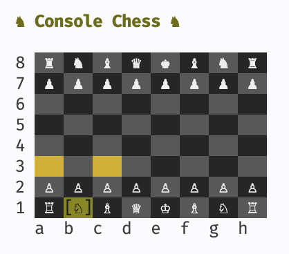
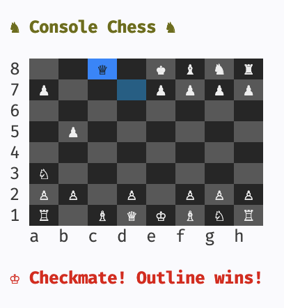

# Console Chess

TUI chess in Java — play against an ELO ~1000 AI in your terminal.

 

## Quick Start

```bash
./scripts/chess.sh play
```

This builds the JVM distribution if needed, then launches the game.

## Install

Install the native binary via Homebrew:

```bash
brew tap d-led/homebrew-d-led
brew install console-chess
```

## Downloads

Pre-built native binaries from the latest `main` build:

| Platform    | Download                                                                                              |
| ----------- | ----------------------------------------------------------------------------------------------------- |
| Linux x64   | [console-chess-linux](https://nightly.link/d-led/console-chess/workflows/ci/main/console-chess-linux.zip)             |
| macOS arm64 | [console-chess-macos-arm64](https://nightly.link/d-led/console-chess/workflows/ci/main/console-chess-macos-arm64.zip) |
| Windows x64 | [console-chess-windows.exe](https://nightly.link/d-led/console-chess/workflows/ci/main/console-chess-windows.zip)     |

Unzip, make executable (`chmod +x console-chess`), then run `./console-chess`.

## Controls

| Key             | Action                     |
| --------------- | -------------------------- |
| Arrows / `hjkl` | Move cursor                |
| Enter / Space   | Select piece, confirm move |
| `q`             | Quit                       |

## Engines

Four engines behind a common `ChessEngine` interface. Select with `-e`:

```bash
./scripts/chess.sh play       # default: noise, medium
console-chess -e noise -d easy        # ELO ~750
console-chess -e noise -d hard        # ELO ~1250
console-chess -e adam                 # ELO ~1600, minimax + piece-square tables
console-chess -e greedy               # ELO ~500, captures everything
console-chess -e stockfish -d easy    # Stockfish capped at ELO 1350
console-chess -e stockfish -d hard    # Stockfish capped at ELO 2800
console-chess -e noise -d medium -s 42  # reproducible with seed
```

The `stockfish` engine runs the [Stockfish](https://stockfishchess.org/) chess engine as a
subprocess over the UCI protocol. Install it first (e.g. `brew install stockfish`); it does not
need to be present for the other engines.

| Engine            | ELO      | Description                                       |
| ----------------- | -------- | ------------------------------------------------- |
| `noise` (default) | 750–1250 | Material + center + mobility + configurable noise |
| `adam`            | ~1600    | Minimax search + piece-square positional tables   |
| `greedy`          | ~500     | Always captures highest-value piece               |
| `stockfish`       | 1350–2800 | Stockfish via UCI subprocess, Elo-limited by `-d` |

## Scripts

All commands live in `./scripts/chess.sh`:

```bash
./scripts/chess.sh play       # build if needed, then run (JVM)
./scripts/chess.sh build      # build JVM distribution only
./scripts/chess.sh test       # run all tests
./scripts/chess.sh native     # build native binary (GraalVM)
./scripts/chess.sh nrun       # build native if needed, then run
./scripts/chess.sh ci         # test + native build
```

## Native Build

Produces a dependency-free binary. Requires GraalVM — set `GRAALVM_HOME` or the script defaults to:

```
/Library/Java/JavaVirtualMachines/graalvm-25.jdk/Contents/Home
```

```bash
GRAALVM_HOME=/path/to/graalvm ./scripts/chess.sh native
./build/native/nativeCompile/console-chess
```

## Project Structure

```
src/main/java/chess/
├── ChessApp.java              # Entry point
├── engine/
│   ├── Color.java             # OUTLINE / FILLED
│   ├── Piece.java / PieceType.java
│   ├── Square.java / Move.java
│   ├── Board.java             # 8×8 grid + move execution
│   ├── MoveGenerator.java     # Legal move generation + check detection
│   ├── Fen.java               # Position → FEN serialization
│   └── GameState.java         # Turn management + game status
├── ai/
│   ├── ChessEngine.java      # Interface: name() + selectMove()
│   ├── NoiseEngine.java      # ELO 750-1250 (default)
│   ├── AdamEngine.java       # ELO ~1600, minimax + piece-square tables
│   ├── GreedyEngine.java     # ELO ~500, captures everything
│   ├── StockfishEngine.java  # Stockfish via UCI subprocess (UciChannel)
│   ├── UciChannel.java       # stdio abstraction for UCI engines
│   └── SubprocessUciChannel.java  # ProcessBuilder-backed UciChannel
└── tui/
    ├── ChessModel.java        # tui4j Model: board, cursor, piece selection
    └── virtual/
        ├── VirtualTerminal.java  # Captures rendered output for testing
        └── GamePrinter.java      # Renders GameState to VirtualTerminal
```

## Tech Stack

- **Java 21** + **Gradle 8.14** (native image built with **GraalVM 25**)
- **[tui4j](https://github.com/WilliamAGH/tui4j)** — terminal UI (Elm Architecture)
- **JUnit 5** + **AssertJ** — unit tests
- **[ApprovalTests](https://github.com/approvals/ApprovalTests.Java)** — snapshot testing
- **GraalVM** — optional native binary

## Acknowledgements

`AdamEngine` is a Java port of the evaluation and search logic from
**[adam-mcdaniel/chess-engine](https://github.com/adam-mcdaniel/chess-engine)**
(MIT license). The piece-square positional tables and negamax minimax
search are adapted from that project.
